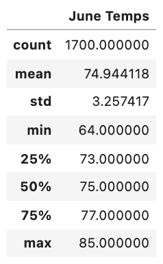
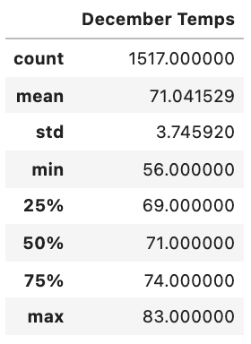

# Surfs-Up

## Overview of Analysis

The purpose of this project is to determine the feasibility of opening a Surf n' Shake shop in Oahu, Hawaii. This analysis will focus on analyzing  weather and temperature data for the months of June and December, in order to determine if the surf and ice cream shop business is sustainable year-round.

## Results

The data preparation utilizes Python, Pandas functions and methods, and SQLAlchemy to analyze and create summary statistic reports. Insight are generated on the <a href="SurfsUp_Challenge.ipynb">Surfs Up Analysis Report</a>. 

### Analysis 1: Summary Statistics for June

The June temperature analysis filters the date column of the Measurements table in the hawaii.sqlite database to retrieve all the temperatures for the month of June. The summary statistics for June is presented in the table below.

### Analysis 2: Summary Statistics for December

The December temperature analysis is identical to the June analysis, except it focuses on retrieving all the temperature data for the month of December. The summary statistics for December is presented in the table below.

### Key Results

After conducting the summary statistic analysis, the 3 key results are:

1. The average temperature in June is hotter than it is in December but the standard deviation of December is larger than June. That means that although June is hotter on average, that December's variation from the average is greater.

2. The range from the minimum temperature to maximum temperature for June is 21 degrees, where as for December it is 27 degrees. December has a larger range for temperature.

3. The minimum temperture for June is 62 degrees, whereas the minimum temperture for December is 56 degrees. This is significantly lower than June's temperture as it can get 9 degrees colder. But the maximum temperature is relatively the same and only 2 degrees off. 

## Summary

### Key Summary

Overall, June's weather is better for the Surf n' Shake shop because it is on average warmer and does not have as much variation in its standard deviation. In addition, the difference between the minimum and maximum temperture varies less with the minimum temperature in June at 64 degrees, whereas December going as low as 56 degrees. 

### Recommended Additional Queries

The recommdned additional queries to conduct are:

1. **Precipitation Statistics** 

    In this query, we can determine what month has the most precipitation. This can effect whether or not the Surf n' Shake shop will have a lot of cutsomers as rain can hinder people from surfing or coming to the store. 

2. **Additional Temperture Statistics**

    In this analysis, we only looked at June and December's temperature statistics. It would be worthwhile to analyze the other months and see if there are any additional months that can prevent the opening of the Surf n' Shake shop. 